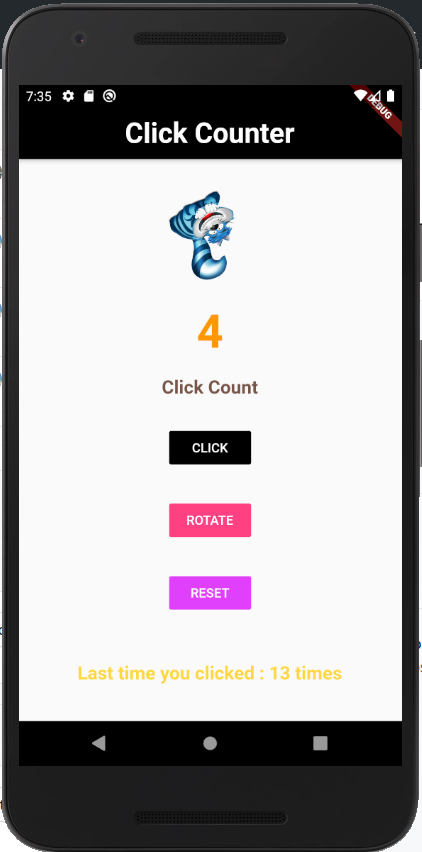

# ClickCounter
For HACTOBERFEST (Beginners) : Will count the number of times a button is clicked.
- Task 1:
  - Add TextView and Button 
  - Display the number of times a button has been clicked
  - Add other improvements like borders, animations
   
  Task 1 completed succcessfully !
    
  
  
- Task 2
  - Every time button is clicked rotate an image
  - Change the color of button on every button click
  - Try same eith other animations and other images(10 atleast)
  
- Task 3
  - Connect to firebase
  - Store data to firebase and fetch data when the user open the app again to show the the prvious button clicks
  - Update the new button count in firebase
  
 - Task 4
   - Add a offline tic-tac toe game in a new activity
   - Add layout grid
   - Add functionalities Refer: https://github.com/Khali851999/TicTacToe
  

1. Star, Fork the repo
2. add code to the forked version
3. commit the code
4. make a pull request
5. add your code features
6. submit PR
